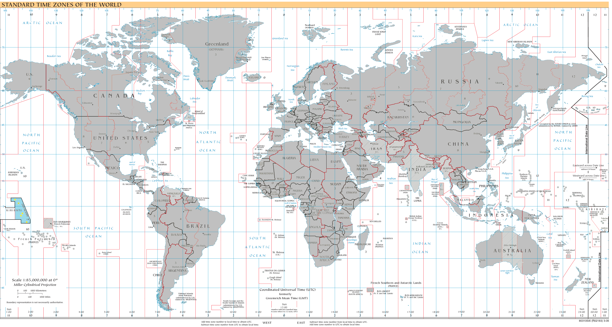

# utc_java

## Working with UTC date time using Java  

Over the years, I've been working on dates and times using different computer languages. 
Sometimes, the date times were stored as ___local times___, other times as UTC. There are advantages and disadvantages with both methods.

These are some working java functions that I use when working with UTC and Java.


## How to use the project files

    The following files could run in any java ide:
        JUnit will need to be installed and included in the classpath in order to run the junit tests.
        Add gradle dependency to handle JSONObjects

    1. UtcUtils.java     java class with time functions  
    2. UtcUtilsTest      junit tests 
## About me

I'm a developer that started a while back using different programming languages. 

The method for handling UTC in each language is the same.

You would imagine that using date and times would be straight forward, and it can be, but some concepts need to be understood beforehand.

For a hobby, I flew light aircraft. UTC is used as convention in the aviation industry, so I am comfortable with it.

I once went on holiday from Ireland to Spain (which is one hour ahead). It was on the weekend of time change for daylight saving time (+1 hour).
One of the party asked, did Spain also have a DST time change that weekend ? and what time is it now ? 

Millions of date time computer transactions happen every day, using UTC to deal with scenarios like this. 

This is my contribution to the community.

## License

The code in the Java functions is readily available on the internet. Use it as you wish.    


## Background to UTC

**[timeanddate][8] Website**


### GMT
GMT used to be the forerunner for timekeeping and was popular in the 1950's when aviation began to take off. 
GMT is a time zone whereas UTC is a time standard. 
GMT is based on astrology whereas UTC is based on international atomic time (TAI) using hundreds of atomic clocks in many countries.
GMT is widely used today, but industry sectors use UTC as the preferred time choice.


### **[UTC also known as Coordinated Universal Time][4].**


UTC is now the time of choice used by the aviation industry, United Nations, NASA, the International Space Station, satellite technology, weather stations etc.

**[GMT replaced by UTC, National Hurricane Center][7]:**
"Prior to 1972, this time was called Greenwich Mean Time (GMT) but is now referred to as Coordinated Universal Time or Universal Time Coordinated (UTC). It is a coordinated timescale, maintained by the Bureau International des Poids et Mesures (BIPM)." 


map of UTC zones by wikipedia


There are many timezones around the world. Some have regional variations e.g. daylight saving time. This can make using times confusing.

UTC is the **primary global** standard, adopted by the scientific community, it's the same time everywhere, no regional variations, no daylight saving time changes.
6pm UTC in New York is 6PM UTC in Australia.

_Time Zones_ are geographical areas of the world, delimited by longitude, that observe UTC time, but with or without a regional variation.
GMT is a time zone, but not all countries in a region observe the same time and may be observing daylight saving time.
Pacific, Mountain, Central and Eastern are time zones that observe daylight saving time.


Because UTC is the primary standard, databases will store dates as UTC dates, indeed some by default.

Having stored the date time as UTC, depending on the use case, displaying UTC time  back to the user will not be desirable in most cases, therefore conversion back to _local time_ will be required.

**Take Local time as seen by user --> store it as UTC --> convert it back to Local time for user**

###  Handling UTC

### What does a UTC date time look like ? 

Developers all over the world use UTC dates, a "data contract" or standard was made so that developers know the _correct_ format of a UTC date time.

    valid formats:

    YYYY-MM-DDThh:mm:ss.SSSZ
    YYYY-MM-DDThh:mm:ss.SSS+00:00
    YYYY-MM-DDThh:mm:ss.SSS-00:00


 **[ISO 8601 global standard][2]:** is the industry accepted standard used to handle the prossing of UTC formatted dates in program code.


### An example of the ISO8601 format


UTC formatted dates, can come in different variations, as Z(zulu) dates or offset date times


### "Z" date time or Zulu date time

    2022-10-15T09:45:00.000Z        example utc string using "z" format
    YYYY-MM-DDThh:mm:ss.SSSZ        break down format

### Offset time:   ±00:00
    2022-10-15T09:45:00.000+00:00   same utc string using offset format
    YYYY-MM-DDThh:mm:ss.SSS+00:00   break down format, the offset may be negative -00:00 from -12:00 to +12:00

### Offset time is usually between +12:00 to -12:00
Most maps showing UTC will show offsets of between +12:00 to -12:00

#### The "_most advanced time_"  

The most advanced time in the world at **+14:00** is Kiribati ,island in Oceania, Pacific Ocean 

Kiribati has a zone id of Kiritimati, with a UTC+14:00 is the _most advanced time zone_ in the world, meaning that Kiribati is one of the first countries to celebrate a New Year, 


The following UTC time (or z time)

`2022-10-15T09:45:00.000Z`

has a local time in Kiritimati of:

`2022-10-15T23:45+14:00[Pacific/Kiritimati]`


### Format


    
    YYYY = four-digit year
    MM   = two-digit month (01=January, etc.)
    DD   = two-digit day of month (01 through 31)
    T    = indicates that the time value is to follow
    hh   = two digits of hour (00 through 23) (am/pm NOT allowed)
    mm   = two digits of minute (00 through 59)
    ss   = two digits of second (00 through 59)
    SSS  = one or more digits representing a decimal fraction of a second
    TZD  = time zone designator (Z or +hh:mm or -hh:mm)


### Converting back from UTC to local time

#### Time zone

While the _world_ operates on UTC time, displaying the UTC time back to the user in the majority of situations will not be helpful or desireable.
It will need to be converted back to time zones, that may be using daylight saving time.

Converting back from UTC to local time needs a time zone and its associated offset.

These are just an example of some java time zone id's, at time of writing there are 628.


    America/Juneau
    America/Kentucky/Louisville
    America/Kentucky/Monticello
    America/Knox_IN
    America/Kralendijk
    America/La_Paz
    America/Lima
    America/Los_Angeles
    America/Louisville
    America/Lower_Princes
    America/Maceio
    America/Managua
    America/Manaus
    America/Marigot
    America/Martinique
    America/Matamoros
    America/Mazatlan
    America/Mendoza
    America/Menominee

The full list of time zones id's can be found using:

`public static String[] getTimeZoneIds() { return TimeZone.getAvailableIDs();
    }`


## Explicit Time Zone or System Default Time Zone

With the UTC and time zone id, the local time can be derived:

UTC and Time Zone = Local Time

Often, the explicit time zone is not required or even known by the user, the **system default** time zone can be used. Java reads the time
zone information from the device operating system to get the default.

e.g.If a web page user was prompted with, "what's your time zone id ?", they would understandably not know it in the majority of cases. To avoid explaining the concept of UTC to the user and why a zone id is required the **system default** time zone is used .


`ZoneId zoneid = ZoneId.systemDefault();`

As a developer, there may be times when specific time zone id's will be required to use local times in a different region. 
For example, if an airline ticket was being purchased in the US for a flight in Sydney Australia, the specific time zone of Sydney Australia would be required to print local times for Sydney on the ticket. 
The system default time (somewhere in the USA) could not be used as the time in Sydney, Australia is needed.
Therefore, an explicit time zone id will be required:

`ZoneId zoneid = ZoneId.of("Australia/Sydney");`

## Java Exceptions

When dealing with Java Strings, there is the potential to make typing errors e.g. Australia/Sidney. 
Best practice is to catch typo's which generate parsing exceptions, and deal with them. Typical catch blocks would be:

* ParseException
* DateTimeParseException
* ZoneRulesException

an example of ZoneRulesException, where Sydney is spelled incorrectly:
```
try {
        ZoneId zoneid = ZoneId.of("Australia/Sidney");
        // other code
    } catch (ZoneRulesException zre) {
        System.out.println("ZoneRulesException: " + zre.getMessage());
    }
}
```

## Java Epoch or Unix Epoch
Milliseconds are often seen in time conversions.

January 1st, 1970 at 00:00:00 UTC is referred to as the Unix or Java epoch. Unix engineers picked that date arbitrarily because they needed to set a uniform date for the start of time in the Unix world.

From that date, the milliseconds will count up and be positive, prior to that date, the milliseconds will count backwards and be negative.


### **Java[ Instant ][5]using milliseconds**
`Instant instant
= Instant.ofEpochMilli(milliseconds);`

The range of an instant requires the storage of a number larger than a long. To achieve this, the class stores a long representing epoch-seconds and an int representing nanosecond-of-second, which will always be between 0 and 999,999,999. The epoch-seconds are measured from the standard Java epoch of 1970-01-01T00:00:00Z where instants after the epoch have positive values, and earlier instants have negative values. For both the epoch-second and nanosecond parts, a larger value is always later on the time-line than a smaller value.


## Java Documentation
**Official documentation: Java 8 Oracle Docs [localdatetime][1]**


**Java [Date Time Tutorial][6]**

Java Classes tables used in the tutorial


## Regex pattern for offset or Zulu time

This is an example regex that I use to locate _±00:00_ and _00:00Z_ string patterns

`([-+]\d{2}:\d{2}|\d{2}:\d{2}Z)`

see in action on [regex101.com][9]

## Return a JSON String
### JSONObject, create

```
   JSONObject jsonObject = new JSONObject();
   jsonObject.put("name", g3);
   jsonObject.put("offset", g2);

   if (g2.contains("Z")) {
        jsonObject.put("Zulu", true);
   } else {
        jsonObject.put("Zulu", false);
   }

   return jsonObject.toString();
   ```

an example jsonObject string:

`{"offset":"09:45Z","name":"[Africa/Abidjan]","Zulu":true}`


### JSONObject, using
```

   // get JSON string
   String jsonString = utcUtils.getRegex_json(actualValue);
  
   // make a JSONObject
   var utcJSON = new JSONObject(jsonString);

   String name = (String) utcJSON.get("name");
   String offset = (String) utcJSON.get("offset");
   Boolean isZuluTime = (Boolean) utcJSON.get("Zulu");
   
   ```


[1]: https://docs.oracle.com/javase/8/docs/api/java/time/LocalDateTime.html "Oracle docs: Java 8 Localdatetime"
[2]: https://en.wikipedia.org/wiki/ISO_8601 "ISO 8601"
[3]: https://en.wikipedia.org/wiki/List_of_time_zones_by_country "Time Zones by country"
[4]: https://en.wikipedia.org/wiki/Coordinated_Universal_Time "Coordinated Universal Time"
[5]: https://docs.oracle.com/javase/8/docs/api/java/time/Instant.html "Java Instant"
[6]: https://docs.oracle.com/javase/tutorial/datetime/index.html "Java Tutorial"
[7]: https://www.nhc.noaa.gov/aboututc.shtml#:~:text=Prior%20to%201972%2C%20this%20time,%22%20or%20%22Zulu%20Time%22. "National Hurricane Center"
[8]: https://www.timeanddate.com/time/aboututc.html "timeanddate"
[9]: https://regex101.com/r/jdAyxT/1 "regex example"


